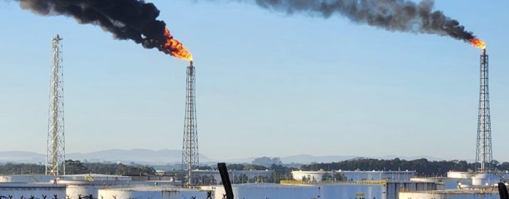
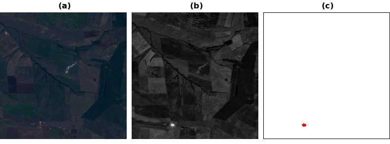

# **FlareSat**

## Introduction

**FlareSat** is a deep-learning semantic segmentation project designed for **gas flare detection** using **Landsat 8 satellite imagery**. Gas flaring plays a safety role in oil and gas operations, but large-scale flaring emits substantial greenhouse gases, making reliable monitoring crucial for assessing and mitigating environmental impact. While satellite imagery provides global, multispectral, and openly accessible data, there is a lack of open datasets and deep-learning resources specifically tailored for gas flare detection.

<p align="center">
  
  <br>
  <em>Gas flare example from the Araucaria facility.</em>
</p>

To address this gap, FlareSat introduces a specialized dataset consisting of **7,337 labeled image patches** (256 × 256 pixels) representing **5,508 facilities across 94 countries**, covering both onshore and offshore production sites. To improve robustness, the dataset also includes visually similar sources—**wildfires, active volcanoes, and reflective urban areas**—which commonly lead to false positives in flare detection tasks.

<p align="center">
  
  <br>
  <em>Example of a flare on Landsat 8. (a) RGB patch; (b) B7 band patch; (c) flare segmented pixels shown in red.</em>
</p>

This repository provides the complete pipeline for research and reproducibility, including the **dataset**, **training**, **evaluation**, and **inference** modules, along with baseline and enhanced deep-learning models for semantic segmentation.

A corresponding research article is currently submitted as a **preprint** to the **Journal of the Brazilian Computer Society (JBCS)**.

---

## Features

- **Gas flare detection and segmentation** from Landsat 8 scenes, with support for TIRS and OLI bands  
- Inclusion of false positives such as wildfires and urban areas to improve model robustness  
- Deep learning architectures for semantic segmentation (U-Net, Attention U-Net, Transfer Learning)
- Training, evaluation, and inference pipelines  
- Spatial cross-validation across continents to reduce geographic bias

---

## Project Structure

```bash
flaresat/
├── dataset/ # Dataset folders and CSV files split by categories (flare, wildfire, urban_areas)
├── inference/ # Inference scripts and model application
├── models/ # Model architectures and saved metrics
├── sources/ # CSV files from VIIRS Nightfire, WorldCities (see paper for full methodology)
├── train/ # Training scripts, configurations, logs, metrics
├── requirements.txt
└── README.md
```


---

## Prerequisites

To run this project, ensure you have:

- **Python 3.9+**
- **pip** installed  
- **CUDA-enabled GPU** (recommended for training)

---

## Installation

### 1. **Create a virtual environment**
```bash
python3 -m venv venv
```

### 2. **Create a virtual environment**
Linux/macOS
```bash
source venv/bin/activate
```

Windows
```bash
venv\Scripts\activate
```

### 3. **Create a virtual environment**
```bash
pip install -r requirements.txt
```

---

## Dataset

For the complete methodology used to build the dataset, please refer to the paper. Download the dataset structure from Zenodo:

- **Landsat 8 dataset** (available on Zenodo: https://zenodo.org)

Place the images under each folder following the same structure described below.

### Masks

Masks contain the segmentation labels in shape **(256, 256, 1)**:

- `dataset/fire_masks`
- `dataset/flare_masks`
- `dataset/urban_areas_masks`

### Patches

Patches contain the model input tensors in shape **(256, 256, 10)**:

- `dataset/fire_patches`
- `dataset/flare_patches`
- `dataset/urban_areas_patches`

### CSV Files

The CSV files listing all patches across categories are located in the `dataset/` folder:

- `flare_dataset.csv` — contains *tiff_file* and *mask_file* paths for flare samples  
- `fire_dataset.csv` — contains *tiff_file* and *mask_file* paths for wildfire samples  
- `urban_dataset.csv` — contains *tiff_file* and *mask_file* paths for urban area samples

---

## Training
You can run the training process using the following command:

```bash
python train/cross_train.py
```

All hyperparameters, model architectures, and dataset paths used during training are defined directly within each model file and can be found in the `models/` directory.

---

## Evaluation

Before running the evaluation, ensure that the trained models are located in the directory: `train/train_output/cross_validation/`. You can also download the trained models from: [FlareSat Models](https://drive.google.com/drive/folders/1IuNawpQb5Nxkv9mQhvNWspSkQE30kzbW?usp=drive_link).

To evaluate the FlareSat models, run:

```bash
python train/evaluation_cross_train.py
```

The evaluation process generates a CSV file at `train/train_output/cross_validation/cross_train_results.csv`, which includes all model architectures, band combinations, and configurations used during training. This serves as a verification step to ensure that the results reported in the paper are consistent and reproducible.

---

## Inference
To run inference on new Landsat 8 image patches (note that the patch shape must match the input requirements of the selected model; for details about available models and their band combinations, please refer to the paper):

```bash
python inference/infer.py --image path/to/image.tif --model models/best_model.pth
```

---


## Citation

If you use FlareSat in academic research, please cite:
[Preprint currently under review at the Journal of the Brazilian Computer Society (JBCS). 
Full citation will be added upon publication.]

---


## Contact

For questions, suggestions, or collaboration:

**Osmary (Mary) Camila Bortoncello Glober**  

Email: marycamilainfo@gmail.com  

GitHub: https://github.com/marycamila184

Lattes: http://lattes.cnpq.br/0331994522046004 


**Ricardo Dutra da Silva**  

Email: rdsilva@utfpr.edu.br

Lattes: http://lattes.cnpq.br/8512085741397097 

---


## Acknowledgments

- **USGS for providing Landsat 8 data**  
  - Earth Resources Observation and Science (EROS) Center. (2020). *Landsat 8-9 Operational Land Imager / Thermal Infrared Sensor Level-2, Collection 2.* U.S. Geological Survey. https://doi.org/10.5066/P9OGBGM6

- **VIIRS for the study of gas flares and for providing the georeferenced CSV points**  
  - Elvidge, Christopher D., Mikhail Zhizhin, Feng-Chi Hsu, and Kimberly E. Baugh. “*VIIRS Nightfire: Satellite Pyrometry at Night.*” Remote Sensing 5, no. 9 (2013): 4423–4449. Data source: https://eogdata.mines.edu/products/vnf/
